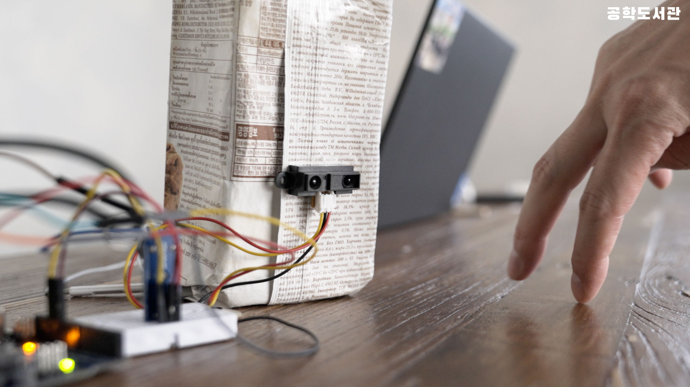
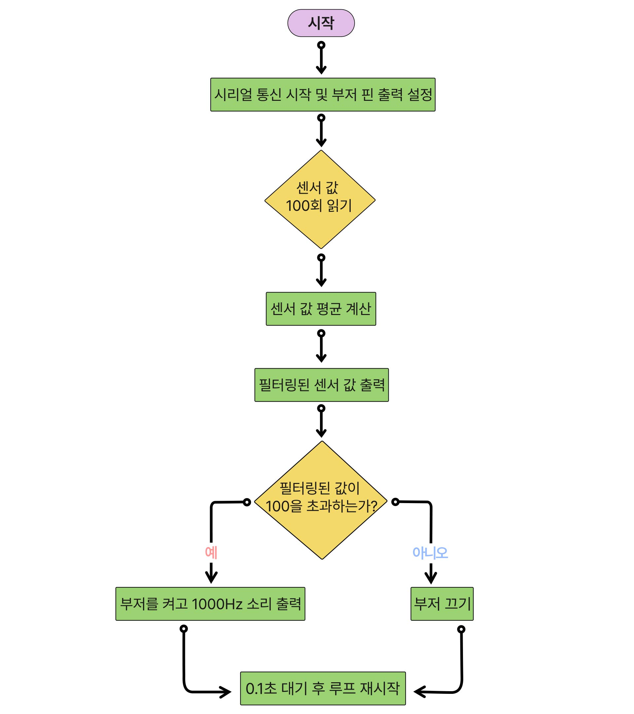

# 🎬 공학도서관 오리지널 컨텐츠

# 👀 사람 감지 센서 만들기




## 📝 프로젝트 소개
이 프로젝트는 적외선 센서와 피에조 부저를 활용하여 사람의 움직임을 감지하고 경고음을 울리는 장치를 만드는 과정을 설명합니다. 센서값 필터링을 통해 안정적으로 동작하는 감지 시스템을 직접 만들어볼 수 있습니다.

## 📚 사전학습
이 프로젝트를 시작하기 전에 아래 내용을 먼저 공부하고 오시면 좋아요.

- 아두이노 기초
  - 아두이노 IDE 설치하기
  - analogRead() 함수 이해하기
  - 배열 활용법 알아보기

- 센서 다루기
  - 적외선 센서의 원리 이해하기
  - 아날로그 신호 읽는 방법 알아보기
  - 센서 데이터 필터링 방법 이해하기

- 프로그래밍 기초
  - 배열을 이용한 데이터 처리
  - 평균값 계산하기
  - 반복문 활용하기

## 🎯 성취 목표
- 적외선 센서에서 거리 데이터를 읽어올 수 있다.
- 센서 데이터를 필터링하여 안정적인 값을 얻을 수 있다.
- 특정 거리 이상일 때 경고음이 울리도록 할 수 있다.
- 이동 평균 필터를 구현할 수 있다.
- 아날로그 센서값을 활용할 수 있다.

## 🛠 준비물
- 아두이노 우노 보드
- 적외선 센서
- 피에조 부저
- 브레드보드
- 점퍼선
- USB 케이블

## 📋 회로 연결 방법

### 적외선 센서 연결
| Arduino UNO | 적외선 센서 |
|------------|------------|
| A0         | OUT(노란색) |
| 5V         | VCC(빨간색) |
| GND        | GND(검정색) |

### 피에조 부저 연결
| Arduino UNO | 피에조 부저 |
|------------|------------|
| 12         | I/O        |
| 3.3V       | VCC        |
| GND        | GND        |

> **주의**: 센서와 부저의 극성에 주의하여 연결하세요!

## 💾 실습 코드
| 파일명 | 설명 |
|--------|------|
| [filter2.ino](./src/filter2/filter2.ino) | 움직임 감지 및 필터링 코드 |

## 💻 주요 함수 설명
1. `analogRead(A0)`
   - 적외선 센서의 거리값 읽기
   - 0-1023 범위의 아날로그 값 반환

2. 이동 평균 필터
   ```cpp
   float filteredValue;
   for (int i = 0; i < num; i++) {
       filteredValue += sensorValues[i];
   }
   filteredValue /= num;
   ```

## ➡️ 순서도



1. 센서값 배열 한 칸씩 이동 ➡️ 
2. 새로운 센서값 읽기 ➡️ 
3. 20개 값의 평균 계산 ➡️ 
4. 임계값 비교 후 부저 제어

## 🚀 시작하기
1. 회로를 제시된 대로 연결
   - 센서 핀 연결 확인
   - 부저 극성 확인

2. 코드 업로드 준비
   - 아두이노 IDE 실행
   - 포트 선택

3. 코드 업로드하기
   - 코드 검증
   - 업로드 진행

4. 동작 테스트
   - 시리얼 모니터로 센서값 확인
   - 필터링된 값 확인
   - 거리에 따른 부저 동작 테스트

## 🔍 문제해결
- 센서값이 불안정해요
  - 센서 주변의 빛 환경을 확인해보세요.
  - 필터링 샘플 수(num)를 늘려보세요.

- 부저 소리가 안나요
  - 부저의 전원 연결을 확인해보세요.
  - 코드의 임계값을 조정해보세요.

- 너무 민감하게 반응해요
  - 임계값을 높여보세요.
  - 필터링 샘플 수를 늘려보세요.

## 🌟 이렇게 업그레이드 해볼 수 있어요
- LED 경고등을 추가해볼까요?
  소리와 함께 시각적 경고도 줄 수 있어요.

- 거리에 따라 다른 소리를 내볼까요?
  가까우면 높은 음, 멀면 낮은 음을 내도록 할 수 있어요.

- 기록 기능을 추가해볼까요?
  움직임이 감지된 시간을 기록하도록 만들 수 있어요.

## 📚 참고 자료
- [적외선 센서의 원리](https://www.arduino.cc/reference/en/language/functions/analog-io/analogread/)
- [이동 평균 필터 설명](https://www.arduino.cc/reference/en/language/structure/control-structure/for/)
